# Hollowvale (built with game-dev-env)

**Hollowvale** is an open-world survival game on a 2 km island, made with Godot 4.7. It runs on
**Windows, Linux and in the browser**. You wash up on the southern beach with nothing. Gather,
craft tools, hunt, keep warm and fed, and survive the nights, when the **Hollows** walk.

| Tall wavy meadow grass | Forest edge |
|---|---|
| 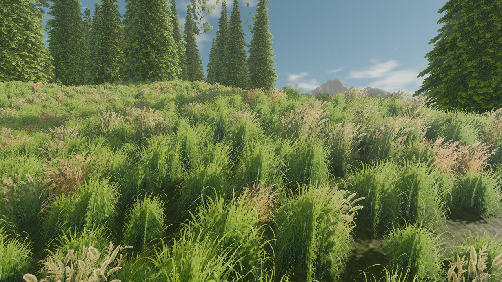 | 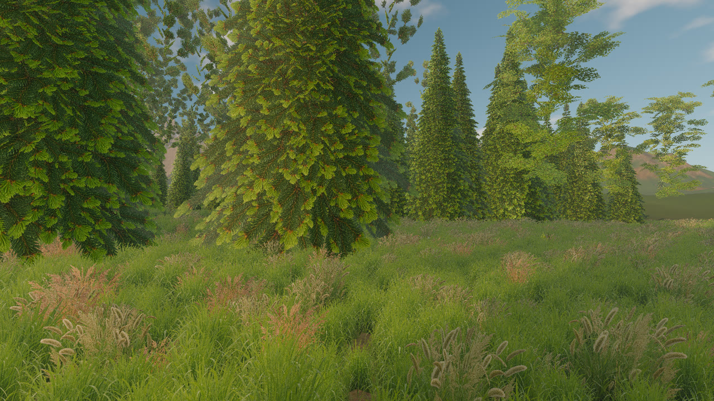 |
| **Mirror Lake at dusk** | **The island from above** |
| 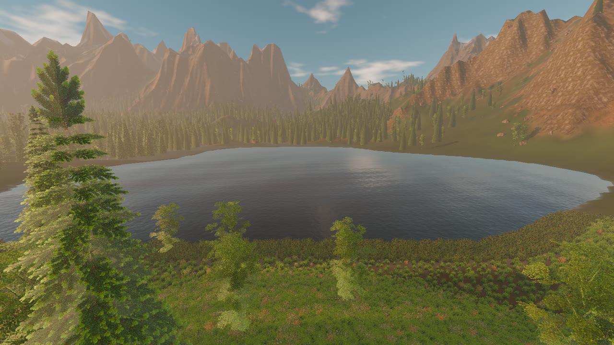 | 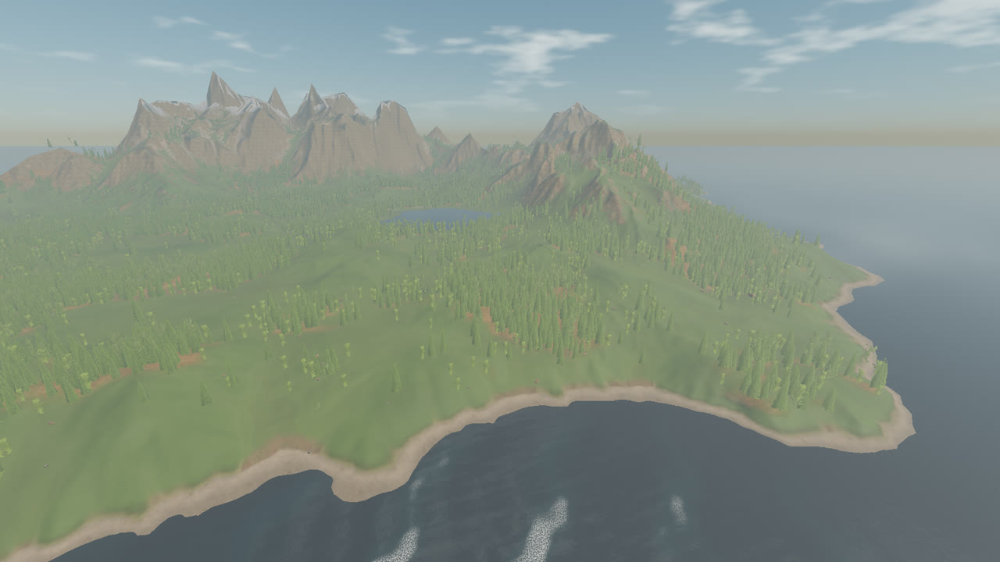 |
| **Survival HUD (hearts, shanks, droplets, warmth)** | **Hollows at night** |
| 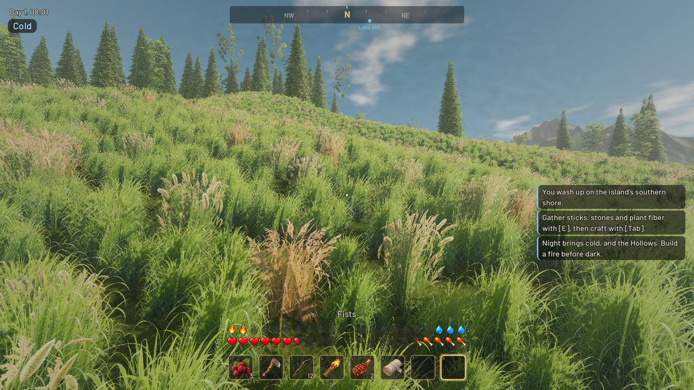 | 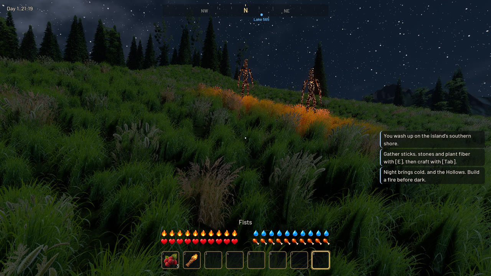 |

These were rendered headlessly on a CPU in the cloud sandbox. On a real GPU the game runs in real time
and looks sharper.

## Play it

| Platform | Easiest | From source |
|---|---|---|
| **Windows** | Double-click **`play-windows.bat`**. It runs `build\windows\Hollowvale.exe` if you have it; otherwise it installs Godot 4.7 with winget and starts the game from source. | `godot --path godot` |
| **Linux / macOS** | **`./play.sh`** (same logic) | `make godot-run` |
| **Browser** | Enable GitHub Pages (Settings → Pages → Source: GitHub Actions), run **Actions → deploy to pages**, then open `https://<you>.github.io/<repo>/godot/`. Add `?play` to skip the title screen. | `make export-web && make serve-godot-web` |

Ready-made builds: every push and PR builds **`hollowvale-windows`** (a single `Hollowvale.exe`),
**`hollowvale-linux`** and **`hollowvale-web`**. Download them from the run's *Artifacts* on the
**Actions** tab, or build them yourself with `make export-all`.

The browser version uses the WebGL 2 renderer: no volumetric fog, SSAO or shadows beyond ~110 m,
and sparser grass. The first load is about 115 MB.

### Controls

| | Keyboard and mouse | Gamepad |
|---|---|---|
| Move / look | WASD / mouse (click to capture) | Left / right stick |
| Sprint, jump / swim up | Shift, Space | L3, A |
| Use / attack / chop / eat | **Left mouse** (hold and release to shoot the bow) | Right trigger |
| Block / aim the bow | **Right mouse** | Left trigger |
| Interact (pick up, drink, harvest, cook) | **E** | X |
| Items | **1-8**, mouse wheel | LB / RB |
| Crafting and pack | **Tab** or C | Back |
| Map / menu | **M** / **Esc** | Start |

### How to survive

- **The HUD reads like Minecraft.** Rows of ten hearts (health), shanks (hunger), droplets (thirst) and
  flames (warmth) drain in half steps. They shiver when critical, flash when you're hurt and ripple
  when you heal. The slim bar above the hotbar is stamina.
- **Start:** press **E** on pebbles (stone), dry branches (sticks) and tall grass (plant fiber). Craft a
  **stone axe** (Tab) and chop trees for **wood**. Pick **berries** from bramble bushes.
- **Water:** drink from **Mirror Lake**; the sea is salt water. Craft a **waterskin** from wolf hides
  to carry water.
- **Fire:** a **campfire** (4 wood, 4 stone) warms you, cooks raw meat and marks your respawn point.
  Hollows won't come near a lit fire. Feed it wood to keep it burning.
- **Nights are cold and dangerous.** Warmth drops after dark (faster up in the mountains or when wet),
  and freezing hurts. Carry a **torch** or stay by a fire.
- **Wolves** hunt in packs in the forests, by day and night. Watch for the crouch before the lunge,
  and block (right mouse) or keep them at spear's length. They drop meat and hides.
- **Hollows** rise at night: burnt husks with embers glowing through their cracks. They wind up a
  heavy overhead slam, fear fire (torch hits burn them), and burn to cinders at dawn. Their bones make
  the best spear. There are more of them every night, and far more in **the Blight**, the dead forest
  in the north-west.
- Ten recipes: stone axe, pickaxe, spear, bone spear, hunting bow, arrows, torch, bandage, campfire,
  waterskin. The game autosaves; Continue on the title screen resumes.

### What's in the world

- **Island:** 2 km of terrain generated with hydraulic erosion (`tools/world/build_world.py`): a
  mountain range with snow, valleys, beaches and a lake. It's drawn by a GPU CDLOD terrain with seven
  height-blended Poly Haven PBR layers and triplanar cliffs, and collision matches the rendered
  surface exactly.
- **Tall grass:** about 45k GPU-instanced clumps from five photoreal variants generated with an
  OpenRouter image model (`assets.mjs foliage`). Waves roll across the fields in the wind, the grass
  shows a sheen as it bends, and it parts around you.
- **Forests:** about 13,000 trees (spruce, Scots pine, birch, dead trees) generated in Blender
  (`tools/blender/generate_trees.py`) with AI-generated branch cards and real bark textures. They sway
  in the wind and switch to impostors (captured at startup) in the distance. There are also bramble
  bushes, ferns, logs, stumps and rocks from Poly Haven.
- **Sky and water:** a physically based sky (Rayleigh/Mie scattering), drifting clouds, moon and stars,
  and a full day/night cycle. The ocean has Gerstner swell, refraction and shoreline foam; the lake is
  calm freshwater.
- **Creatures:** skinned wolves (shell fur) and Hollows (ember-cracked husks) built in Blender
  (`tools/blender/generate_creatures.py`) and animated procedurally, so their gaits match their speed.
- **Sound:** Kenney CC0 recordings plus synthesized creature voices and ambience (wind, surf, birds,
  crickets, distant howls) from `tools/audio/make_sfx.py`.

### Graphics settings

Esc → Settings → **Graphics**: Low (the Web default), Medium, High (the desktop default), Ultra.
The presets change grass density and range, shadow distance and resolution, SSAO, volumetric fog and
MSAA. The desktop build uses Forward+ with volumetric fog, SSAO, glow and 8K shadow maps. The game
targets a mid-range GPU at High; if your frame rate is low, try Medium.

### Rebuilding the assets

Everything in the game can be regenerated from this repo:

```bash
make world SEED=7        # island heightmap, erosion, masks, map         (Blender's numpy)
make terrain-textures    # Poly Haven terrain layers -> texture arrays
make trees               # trees and bushes (Blender)
make props               # Poly Haven rocks, logs, ferns, decimated
make creatures           # wolf and Hollow meshes + rigs (Blender)
make sfx                 # sound effects: Kenney CC0 + synthesized
make icons               # item and HUD icons (OpenRouter image model; costs a few cents each)
node tools/openrouter/assets.mjs foliage "<prompt>; <prompt>" --cell 1024x1536 --out atlas.webp  # grass/leaf cards
make godot-import        # then re-import in Godot
```

### Testing

`make selftest` plays the survival loop headlessly in a few seconds. It gathers, crafts, chops, mines,
fights wolves with a spear and a Hollow with the bow, gets bitten, cooks at a campfire, drinks, starves,
waits for night and dawn, dies, respawns and saves, then prints PASS/FAIL for each step. CI runs it on
every push. For pictures, `godot --path godot -- --play --screenshot=out.png` (plus `--cam=x,z,height,yaw,pitch`,
`--time=21`, `--spawn=wolf:2`, `--give=bow,arrow:10`, `--preview` for fast CPU renders) saves a frame and quits.

---

# game-dev-env: the toolkit behind it

A ready-to-run setup for making realistic 3D games that ship **standalone**
(Windows/Linux/macOS) and **in the browser**. It includes AI game art from
**any OpenRouter image model** (HUDs, icons, textures, skies), a headless
**Blender** asset pipeline, and **computer use** for native apps: Claude can see,
click and type in the running game, the Godot editor or Blender. It works in
Claude Code cloud sessions, on Windows, Linux/WSL and macOS, and in GitHub Actions.

| Godot 4.7, desktop (Forward+) | Godot 4.7, browser (WebGL 2) | three.js + Rapier, browser |
|---|---|---|
| 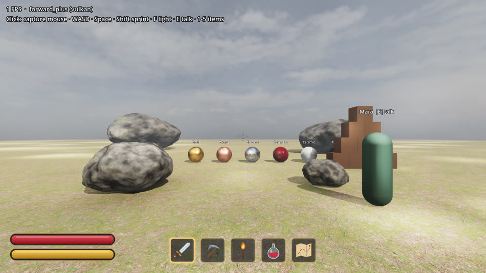 | 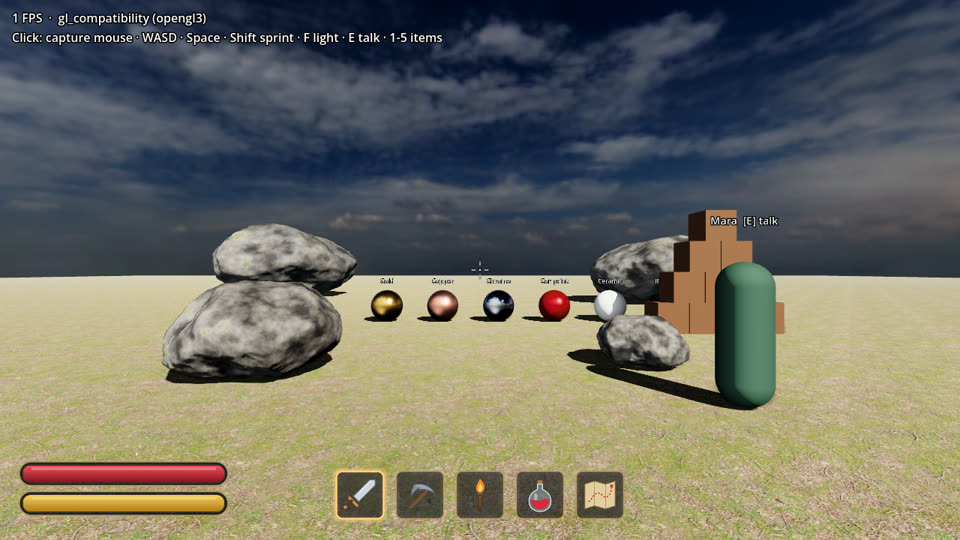 | 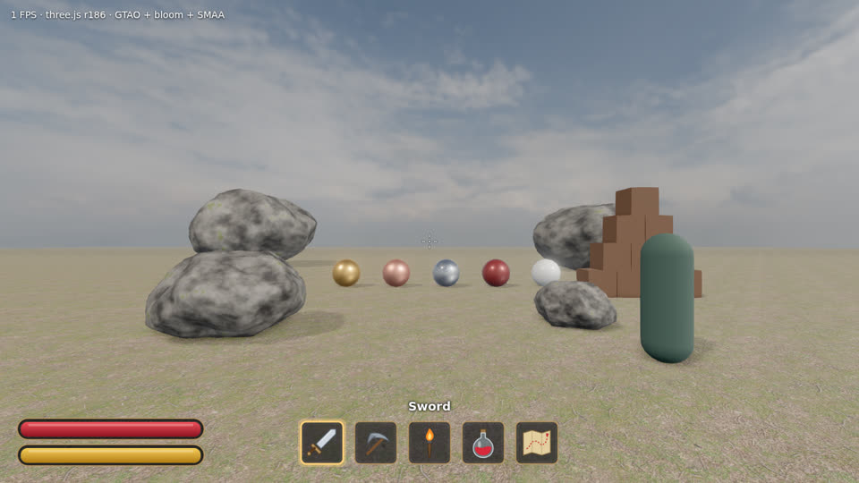 |

These were rendered headlessly in the cloud sandbox on a CPU renderer, which is why the FPS counters are low.

## What's inside

| Part | What you get |
|---|---|
| **`godot/`**: Godot 4.7 project | First-person controller (keyboard, mouse, gamepad). HDRI sky and image-based lighting, SDFGI, SSR, SSAO/SSIL, volumetric fog. Jolt physics props, a PBR material showcase, rocks made in Blender, and an **NPC whose dialogue is written live by an LLM**. Export presets for **Web, Linux and Windows**. |
| **`web/`**: three.js + Rapier + Vite + TypeScript | The same scene in plain web tech: HDRI lighting, soft shadows, GTAO, bloom and SMAA, physics with a character controller, and the same AI NPC. Deploys anywhere static. |
| **`tools/blender/`** | Headless Blender scripts that **generate** a rock and bake its PBR textures to GLB, **convert** any format to GLB/FBX/OBJ (with decimate, rescale, Draco), and **render** previews. |
| **HUD** (both games) | Health and stamina bars (sprinting drains stamina, hard landings hurt), crosshair, 5-slot hotbar with item icons. All art is swappable files, generated by `assets.mjs ui-kit`. |
| **`tools/openrouter/`** | `assets.mjs`: **game art with any image model** (HUD mockups and kits, icons, sprites, tileable PBR textures, skies, image edits), with automatic transparency, trimming and style consistency. `openrouter.mjs`: dialogue, quests, JSON item tables. Plus a small **AI NPC server** that keeps your key out of game builds. |
| **`tools/desktop/`** | **Computer use for native apps**: a virtual desktop with screenshots, mouse, keyboard and screen recording, as a CLI and as an **MCP server** that gives Claude these as built-in tools (`.mcp.json`). |
| **`tools/assets/polyhaven.py`** | Search and download CC0 HDRIs, PBR textures and models from Poly Haven. |
| **`setup/`** | The toolchain installer (also the cloud setup script), a Windows `.bat`, a macOS script, and an export-template fetcher. |
| **`.github/workflows/`** | CI that builds all targets as downloadable artifacts, plus a one-click **GitHub Pages** deploy of both browser games. |

## Getting started

### Option A: Claude Code cloud (claude.ai/code)

Follow **[docs/CLOUD_ENVIRONMENT.md](docs/CLOUD_ENVIRONMENT.md)**. It has every value ready to paste:
network allowlist, environment variables (OpenRouter key, versions) and the setup script.
Then start a session and ask Claude to "run `make doctor`".

This repo's SessionStart hook also installs anything missing, so sessions work
before you configure the environment, as long as the network allows the downloads.

### Option B: Windows

Double-click **`setup\setup-windows.bat`**. It uses winget to install Git, Node.js, Python, Godot 4.7.2 and Blender,
then fetches the Godot export templates and the web template's packages.

```bat
:: play the three.js game
cd web && npm run dev
:: open the Godot project: start Godot and import godot\project.godot
```

### Option C: Linux / WSL

```bash
sudo bash setup/install-toolchain.sh   # Godot + templates, Blender, Xvfb/Mesa/ffmpeg (~35 s)
make setup                             # npm install + Godot import
make doctor
```

Without `sudo`, the installer puts everything in `~/.local` and skips the system packages.

### Option D: macOS

```bash
bash setup/setup-macos.sh              # Homebrew: Godot, Blender, Node, Python + templates
```

## Everyday commands

Run `make help` for the full list.

```bash
make godot-editor        # open the Godot editor
make godot-run           # play the Godot version
make export-all          # build/web, build/linux, build/windows  (standalone + browser)
make serve-godot-web     # play the Godot Web export at http://localhost:8060
make web-dev             # three.js game with hot reload at http://localhost:5173
make web-build           # production build in web/dist
make godot-shot web-shot # headless screenshots in build/shots/ (great for CI and AI agents)
make rock SEED=42        # new procedural rock in Blender
make preview MODEL=godot/assets/shared/models/rock.glb
make convert IN=chair.fbx OUT=godot/assets/chair.glb ARGS="--scale 0.01 --decimate 0.5"
make ai-server           # start the LLM NPC backend
make hud-kit MODEL=sunburst REF=concept/hud.png   # AI-generate the HUD art (any image model)
make play-native         # run the native build on the virtual desktop, walk, screenshot
make doctor              # check what's installed and reachable
```

Controls in the starter demos (`scenes/main.tscn` and the three.js game): **WASD** to move, **mouse** to look
(click to capture), **Space** to jump, **Shift** to sprint (uses stamina), **F** for the flashlight, **E** to talk to Mara,
**1–5** or the mouse wheel for items, **Esc** to release the mouse. Hollowvale's controls are listed at the top.

## AI game art (any OpenRouter image model)

One key gives you every image model on OpenRouter: GPT Image 2.5, Nano Banana, Seedream, Flux, Recraft (vector/SVG), Grok, Qwen and more.
Get one at <https://openrouter.ai/keys> and set `OPENROUTER_API_KEY` (see [.env.example](.env.example)).
Pick the model per command with `--model`. A full id or any unique fragment works:
`--model openai/gpt-image-2.5-sunburst`, `--model sunburst`, `--model "seedream 5 pro"`, `--model "nano banana"`.

```bash
A="node tools/openrouter/assets.mjs"
$A models --transparent                       # image models + what they support
# 1. Design a HUD over a real screenshot of your game (make godot-shot first)
$A hud "gritty survival game" --ref build/shots/godot.png --model sunburst
# 2. Turn the mockup into the actual HUD files both games load (bars, slots, crosshair, icons)
$A ui-kit --ref concept/hud-gritty_survival_game.png --model sunburst
# More assets
$A icon "coil of rope, oil lantern, bear trap" --model flare     # transparent 128px icons
$A texture "mossy cobblestone" --pbr --size 1024                  # tileable albedo + normal/rough/height maps
$A sprite "hooded wanderer, full body" --size 512
$A sky "stormy sunset over mountains" --model "seedream 5 pro"   # 2:1 panorama
$A concept "abandoned radio tower at dusk" --aspect 16:9
$A edit concept/hud-gritty_survival_game.png "make the bars thinner and more minimal"
```

The request adapts to each model's capabilities, which are read live from OpenRouter:
- **Transparent assets:** models with native transparency (GPT Image 2.5, GPT Image 1) get it directly.
  Others get a green or magenta screen that is chroma-keyed out, with edge spill removed.
- **Aspect ratio:** the nearest one the model supports is used, then the result is trimmed and resized to the exact size needed.
- **Style consistency:** the first generated element becomes the reference image for the rest of the kit or icon batch.
  You can also pass your own references with `--ref`.
- **Extras:** `--dry-run` shows the exact request without calling (or paying for) anything, and each run prints its cost.
  `make hud-placeholder` restores the built-in vector art.

**Text** (dialogue, quests, data):

```bash
node tools/openrouter/openrouter.mjs chat "Write 5 idle barks for a paranoid lighthouse keeper"
node tools/openrouter/openrouter.mjs json "12 survival crafting recipes with inputs, outputs, craft_time" --out data/recipes.json
node tools/openrouter/openrouter.mjs models gemini          # browse text models and prices
```

**In-game LLM NPC:** run `make ai-server`, then walk up to Mara (the green figure) and press **E**, in either game.
Games talk to `http://127.0.0.1:8787/chat`. The server adds the key, caps tokens and only allows approved models.
Never put the key inside a game build: anyone can extract it, especially from Web builds.
When you deploy, host `server.mjs` somewhere, set `AI_CORS_ORIGIN`, and point the NPC at it.
In Godot that's the `server_url` export on the Mara node; on the web it's `?ai=https://…/chat`.

## Computer use: driving native apps

Browsers have Playwright. For everything else (the exported game, the Godot editor, Blender's GUI)
there's `tools/desktop`: a virtual X11 display, separate from any real screen, with screenshots, mouse, keyboard and recording.

In Claude Code the repo's `.mcp.json` registers it as an MCP server named `desktop`. Claude then gets tools like
`desktop_launch`, `desktop_screenshot`, `desktop_click`, `desktop_key` (with `hold_seconds` for games),
`desktop_look`, `desktop_type`, `desktop_drag`, `desktop_record` and `desktop_logs`, and can just be asked:
"launch the Linux build, walk to the crates, jump, and show me what it looks like".
Locally, Claude Code asks you to approve the server once.

| Godot editor, driven by clicks (Sun node selected) | Blender GUI, rock imported, shading pie menu opened with a keypress |
|---|---|
| 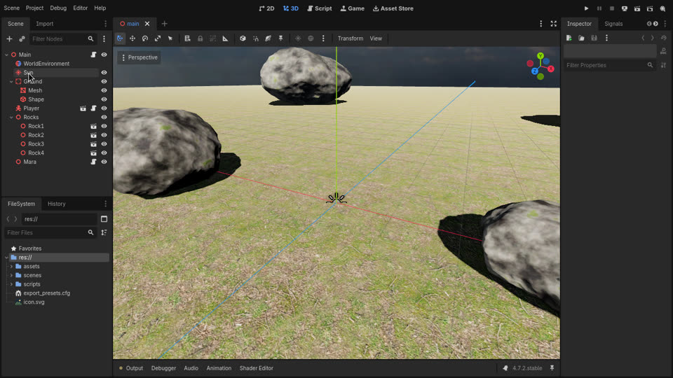 | 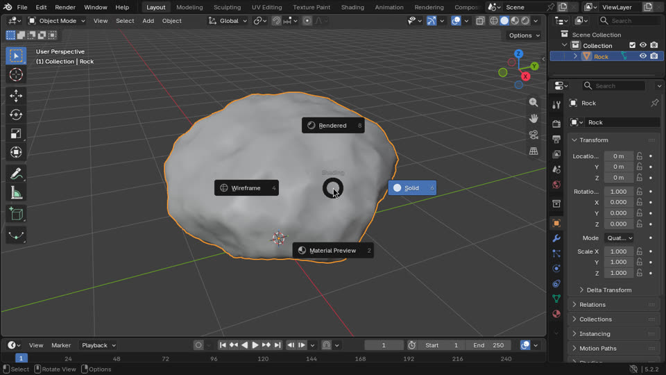 |

Or use it from the shell:

```bash
D="node tools/desktop/desk.mjs"
$D launch "./build/linux/Hollowvale.x86_64 --rendering-driver opengl3" --wait Hollowvale
$D click 640 360            # focus + capture the mouse
$D look 300 0               # turn right
$D key "w shift" --hold 2   # sprint forward for 2 s
$D shot build/shots/me.png  # screenshot
$D launch "godot --path godot -e --rendering-driver opengl3" --wait Godot   # the editor works too
$D record 5                 # 5 s .mp4
$D kill all
```

`make desktop-selftest` checks the whole chain over real MCP: it launches the game, sends input, and verifies the view changed.
Linux only: it runs in the cloud, on Linux PCs and in WSL, and uses `Xvfb`, `openbox`, `xdotool` and `ffmpeg`,
which the setup script installs.

## Asset pipeline

```
Poly Haven (CC0 HDRIs, textures, models) ─┐
OpenRouter image models (HUD, icons, ...) ┼──> Blender (headless): generate / convert / bake / preview
Your own .blend / .fbx / .obj ────────────┘          │
                                                     ▼  .glb
                               godot/assets/shared/ ──> Godot (auto-imports)
                                                   └──> three.js (Vite bundles it)
```

- `python3 tools/assets/polyhaven.py search rock --type models` finds assets, then `model rock_moss_set_01 --res 2k` downloads one.
- `gltf-transform optimize in.glb out.glb --texture-compress webp` shrinks web downloads.
- Everything in `godot/assets/shared/` is CC0 ([credits](godot/assets/shared/CREDITS.md)).

## Shipping

- **Standalone:** `make export-linux` / `make export-windows` produce a single-file executable with the game data embedded.
  For macOS, add the `macos` templates (`GODOT_TEMPLATE_PLATFORMS=web,linux,windows,macos`) and a macOS preset in the editor.
- **Browser:** the Godot Web export is single-threaded, so it needs no special COOP/COEP headers.
  It works on itch.io (zip `build/web`) and GitHub Pages as-is. The three.js build (`web/dist`) is plain static files.
- **GitHub Pages:** in the repo, go to Settings → Pages → Source: **GitHub Actions**.
  Then go to Actions → **deploy to pages** → Run workflow, and both games go live at `https://<you>.github.io/<repo>/`.
- **CI:** every push to `main` builds all targets. Download them from the run's **Artifacts** section.

## Why Godot, and not Unreal?

Godot runs headless in the cloud sandbox and in CI, exports to the browser, and is an 80 MB download.
Unreal needs an Epic account, 60+ GB and a GPU, and it has no browser export.
See **[docs/UNREAL.md](docs/UNREAL.md)** for setting up Unreal on your own PC and using these tools with it.

## Layout

```
.claude/            SessionStart hook + settings for Claude Code
.mcp.json           registers the desktop (computer use) MCP server
.github/workflows/  build.yml (CI artifacts), pages.yml (deploy browser builds)
docs/               cloud setup guide, Unreal notes, screenshots
godot/              Godot 4.7 project; main scene game/world/world.tscn
  game/world/       terrain, grass, foliage, props, water, sky, day/night, campfire (+ data/, shaders/)
  game/player/      player, viewmodel, item models, arrows
  game/enemies/     wolves, Hollows, procedural rigs, spawner
  game/ui/          HUD, crafting, map, pause, title, death screens, icons, fonts
  game/systems/     Game autoload, items and recipes, inventory, sound, ambience
  game/debug/       screenshot/camera harness and the gameplay self-test
  scenes/ scripts/  the original starter sandbox (scenes/main.tscn)
play-windows.bat    play the game on Windows (exe if built, else from source)
play.sh             the same for Linux/macOS
setup/              install-toolchain.sh, setup-windows.bat, setup-macos.sh, fetch_godot_templates.py
scripts/doctor.sh   environment checker
tools/              world/ (island + terrain textures), blender/ (trees, props, creatures), audio/,
                    openrouter/ (text + image assets), desktop/ (computer use), assets/ (Poly Haven)
web/                three.js + Rapier + Vite game (the original starter demo)
```

## Troubleshooting

- **Something's missing:** run `make doctor`. It says what's missing and how to fix it.
- **A download failed in the cloud:** the network policy is probably blocking the host. See step 3 in
  [CLOUD_ENVIRONMENT.md](docs/CLOUD_ENVIRONMENT.md).
- **Godot says export templates are missing:** run `python3 setup/fetch_godot_templates.py`
  (add `--platforms web,linux,windows,macos` to include macOS), or in the editor use
  Editor → Manage Export Templates → Download.
- **Web build shows a black screen locally:** open it through a server (`make serve-godot-web` / `make web-preview`),
  not with `file://`.
- **The NPC says "AI offline":** start `make ai-server` with `OPENROUTER_API_KEY` set.
- **Network weirdness in the cloud** (certificate errors, timeouts, GitHub 403s): see
  [What "Full" actually does](docs/CLOUD_ENVIRONMENT.md#what-full-actually-does).
